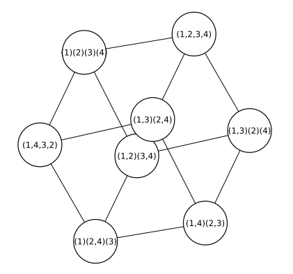

# CayleyGraphs
Simple graphs from permutations

## Creating Cayley Graphs

Let `plist` be a list of permutations of the same length. `CayleyGraph(plist)`
creates an undirected graph whose vertices are permutations and in which 
there is an edge between `v` and `w` if there is a `p` in `plist` such that
`v == p*w` (or `w == p*v`). 

The graph is created by starting with the identity permutation and applying
the permutations in `plist` until the graph is built. 

This function can also be invoked as `CayleyGraph(p1,p2,p3,...)` instead of
`CayleyGraph([p1,p2,p3,...])`.

If the permutations have length `n`, the resulting graph might not have 
`factorial(n)` vertices if there are permutations that cannot be reached 
by combining the permutations in `plist`. The graph returned 
is always connected and vertex transitive. 

## Examples

### Single permutation
If the permutation list contains a single (nonidentity)
permutation, the result is a cycle. 

```
julia> using Permutations, SimpleGraphs, CayleyGraphs

julia> p = RandomPermutation(17)
(1,14,8,16,15,4,11)(2,10,17,12)(3)(5)(6,13,7,9)

julia> order(p)
28

julia> G = CayleyGraph(p)
Cayley Graph (n=28, m=28)

julia> is_connected(G)
true

julia> deg(G)
28-element Vector{Int64}:
 2
 2
 2
 ⋮
 2
 2
 2
```

### Two permutations
Here is a more interesting example:
```
julia> p = Permutation([6,1,2,3,4,5])
(1,6,5,4,3,2)

julia> q = Permutation([2,1,4,3,6,5])
(1,2)(3,4)(5,6)

julia> G = CayleyGraph(p,q)
Cayley Graph (n=18, m=27)
```
### Large example
Cayley graphs can easily be quite large.

```
julia> p = RandomPermutation(8)
(1,2,7,8,4)(3)(5,6)

julia> q = RandomPermutation(8)
(1,5)(2,7,8,6,4)(3)

julia> G = CayleyGraph(p,q)
Cayley Graph (n=5040, m=10080)
```

### Cube as a Cayley graph

```
julia> p = Permutation([2,1,4,3])
(1,2)(3,4)

julia> q = Permutation([4,1,2,3])
(1,4,3,2)

julia> G = CayleyGraph(p,q)
Cayley Graph (n=8, m=12)
```
Here is the result:

